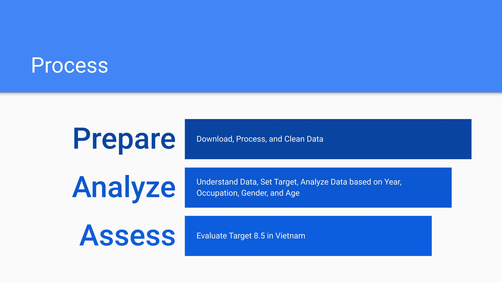

# Sustainable Development Goal 8 Target 8.5 in Vietnam

Exploratory Data Analysis of SDG 8 Target 8.5 in Vietnam using SQLite, Pandas, and Matplotlib.

By: Trang Ha Nguyen (Helen), Pomona 2024

## Introduction

The United Nations Sustainable Development Goals (SDGs) are targets for global development adopted in September 2015, set to be achieved by 2030. All countries of the world have agreed to work towards achieving these goals.

Our SDG Tracker presents data across all available indicators from the Our World in Data database, using official statistics from the UN and other international organizations. It is a free, open-access publication that tracks global progress towards the SDGs and allows people around the world to hold their governments accountable to achieving the agreed goals.

The 17 Sustainable Development Goals are defined in a list of 169 SDG Targets. Progress towards these Targets is agreed to be tracked by 232 unique Indicators. Here is the full list of definitions.

This new version of our SDG-Tracker was launched on 28th June 2018. We will keep this up-to-date with the most recent data and SDG developments through to the end of the 2030 Agenda.

For many Indicators data is available, but major data gaps remain. If you are aware of high-quality data we have yet to include please notify us. We hope that this collaborative approach allows us to support the United Nations in developing the most complete and up-to-date sources for tracking global progress to 2030.

## Goal 8: Decent work and economic growth

Over the past 25 years the number of workers living in extreme poverty has declined dramatically, despite the lasting impact of the 2008 economic crisis and global recession. In developing countries, the middle class now makes up more than 34 percent of total employment – a number that has almost tripled between 1991 and 2015.

However, as the global economy continues to recover we are seeing slower growth, widening inequalities, and not enough jobs to keep up with a growing labour force. According to the International Labour Organization, more than 204 million people were unemployed in 2015.
The SDGs promote sustained economic growth, higher levels of productivity and technological innovation. Encouraging entrepreneurship and job creation are key to this, as are effective measures to eradicate forced labour, slavery and human trafficking. With these targets in mind, the goal is to achieve full and productive employment, and decent work, for all women and men by 2030.

### Goal 8
Promote sustained, inclusive and sustainable economic growth, full and productive employment and decent work for all

### Target 8.5
By 2030, achieve full and productive employment and decent work for all women and men, including for young people and persons with disabilities, and equal pay for work of equal value

### Indicator 8.5.1
Average hourly earnings of female and male employees, by occupation, age and persons with disabilities

### Indicator 8.5.2
Unemployment rate, by sex, age and persons with disabilities

## Process

Download, Process, and Clean Data
- Download Excel file from UNStats
- View Excel file
- Delete empty, repetitive, and irrelevant columns
- Export to CSV 
- Extract Vietnam’s data from initial dataset with SQL in DB Browser for SQLite

## 8.5.1 Average hourly earnings of female and male employees, by occupation, age and persons with disabilities

### Rationale

Earnings are a key aspect of quality of employment and living conditions. Information on hourly earnings disaggregated by various classifications (sex, age, occupation, disability status) provides some indication of the extent to which pay equality is respected or achieved.

### Limitation & Discrepancy

- Missing 2010 data 
- No data on age and disability status → Can only assess 8.5.1 based on average hourly earnings of female and male employees, by occupation
- Earnings statistics present a number of complications in terms of their international comparability, most of which arise from the variety of possible sources of data. The various sources available -- establishment surveys, household surveys and administrative records -- differ in their methods, objectives and scope, which influences the results obtained. The coverage of the source may vary in terms of the geographical areas covered, the workers covered (for example, part-time workers or informal workers may be excluded) and the establishments covered (for example, establishments below a certain size or of a certain sector may be excluded). In cases where the earnings of workers excluded from the coverage of the source are significantly different than those of workers included, the statistics would not be representative of the country as a whole and would not be strictly comparable to those of countries using a more comprehensive source.
- When using household surveys as a source of earnings statistics, there are a number of issues related to the accuracy of the earnings information reported by the respondents. They may over declare or under declare their earnings for various reasons, or they may report gross or net wages while including or excluding bonuses and benefits, without distinction. This naturally affects the reliability of the results.

### Analysis
Consult Jupyter Notebook file (sdg_8_5.ipynb)

### Assessment - Target 8.5 - Indicator 8.5.1
- Progress? Average Hourly Earnings
- Room for Improvement? Gender Gap in Average Hourly Earnings Across Occupation and Over Time
- Recommendation? Data on Age and Persons with Disabilities

